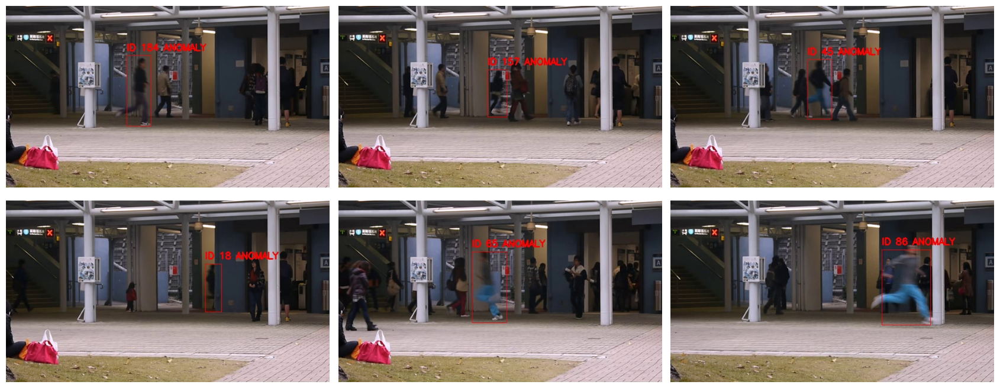
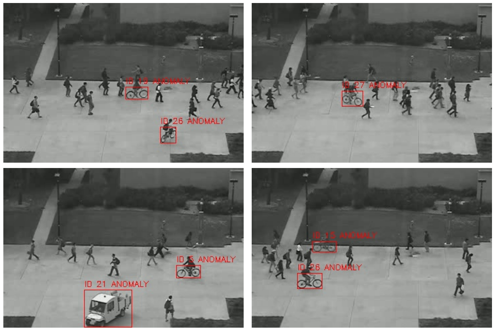
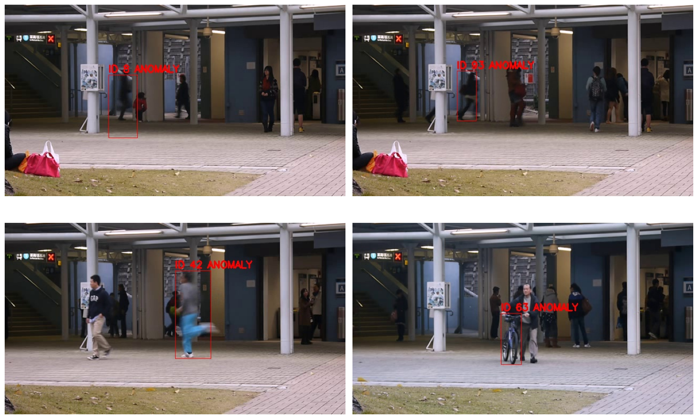

# Anomaly Detection in Pedestrian Surveillance Videos
Seasons of Code 2025, Web and Coding Club, IIT BOMBAY

* This project implements a pipeline for detecting anomalies in pedestrian surveillance footage using object detection (YOLOv5), tracking (DeepSORT), and custom rule-based logic.
* This pipeline is tested on UCSD and Avenue Datasets
---
* The detection part in the pipeline was implemented in two ways:
  1. Using a YOLOv5 model fine-tuned on the MOT17 dataset for pedestrian detection
  2. Using a pre-trained YOLOv5 model trained on the COCO dataset
* By training on MOT17 dataset alone, the objects other than pedestrian cannot be detected.
* So the pipeline containing fine-tuned YOLOv5 detector was used for identifying anomalies associated with pedestrians(used for Avenue dataset)
* Another pipeline containing pretrained YOLOv5 detector was used for identifying wide range of anomlaies like pedestrian running, bicyle and truck ( used for Aveune and UCSD Ped2  datasets)
---

### Key Features

* **YOLOv5** trained on **MOT17** for pedestrian detection (custom detector)/ pretrained YOLOv5m detector
* **DeepSORT** for multi-object tracking across frames
* **Rule-based anomaly detection** based on velocity and objects
* Pedestrian crossing a certain velocity_threshold is flagged as anomaly
* Objects such as bicycle, truck are flagged as anomlay
* **Video output with bounding boxes and IDs** (Red = anomaly)
* Easily tunable parameters: velocity threshold, smoothing

### Datasets Used

* [MOT17](https://motchallenge.net/data/MOT17/) — for training the custom pedestrian detector
  
* [Avenue Dataset](http://www.cse.cuhk.edu.hk/leojia/projects/detectabnormal/dataset.html) — for testing anomaly detection
  
***This dataset accompanies paper "Abnormal Event Detection at 150 FPS in Matlab, Cewu Lu, Jianping Shi, Jiaya Jia, International Conference on Computer Vision, (ICCV), 2013"***

* [UCSD Ped2](http://www.svcl.ucsd.edu/projects/anomaly/dataset.htm)
  
***Citation:***
***Anomaly Detection in Crowded Scenes.***
***V. Mahadevan, W. Li, V. Bhalodia and N. Vasconcelos.***
***In Proc. IEEE Conference on Computer Vision and Pattern Recognition (CVPR), San Francisco, CA, 2010***

---

### Key Anomaly Logic

* **High velocity**
  
  Track object motion over frames using DeepSORT. If speed exceeds a set threshold → mark as anomaly.
  Object like bicycle, truck → mark as anomaly 

* **New/reappearing objects**
  
  Add warmup period to avoid false positives when a person reappears or enters the scene.

* **Smoothing**
  
  Keep anomaly flag active for a few frames after detection to avoid flickering.

---

### Results
***Pipeline with fine-tuned YOLOv5 model on MOT17 dataset***

  #### Average frame level precision = 0.5882
  #### Average pixel level precision = 0.4874

---

***Pipeline with pre-trained YOLOv5 detector***

  ### UCSD Dataset
  #### Average frame level precision = 0.9914
  #### Average pixel level precision = 0.7723

 ### Avenue Dataset
  #### Average frame level precision = 0.4565
  #### Average frame level precision = 0.3880

---

### Applications

   
* Detect unusual pedestrian behavior (e.g., running, loitering, sudden motion) in public places like Airports, Train stations, Shopping malls, Smart cities

* Flag events like Skateboarding, fighting, or people running in restricted areas

