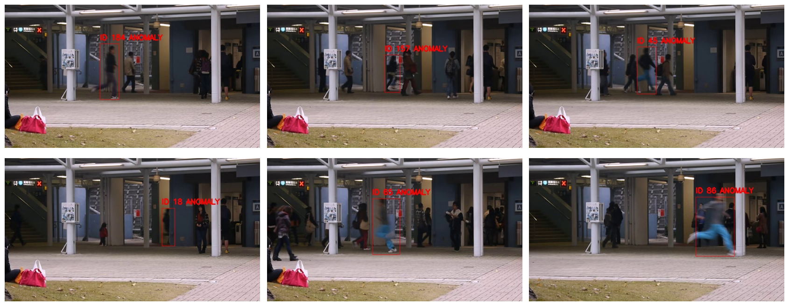
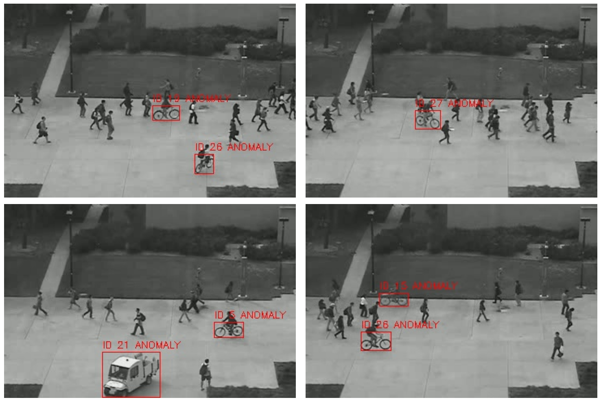
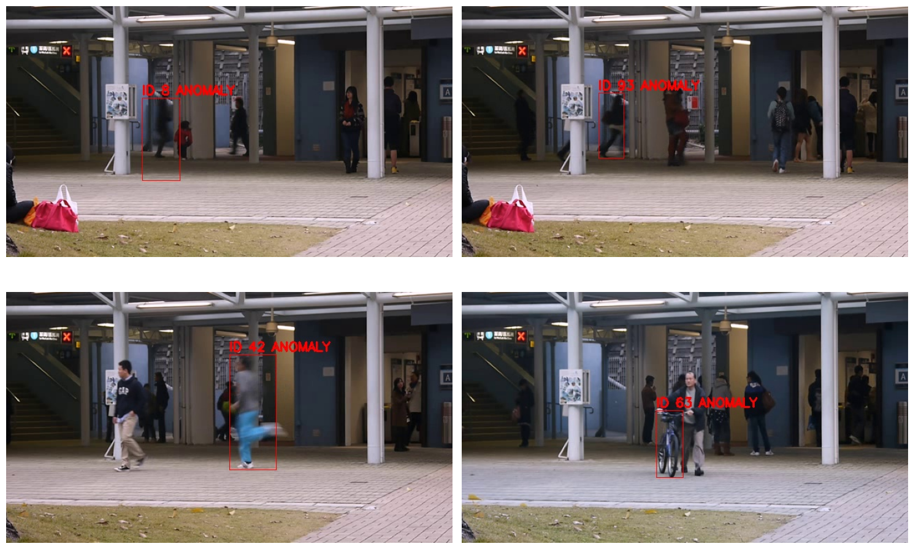

# Anomaly Detection in Pedestrian Surveillance Videos
Seasons of Code 2025, Web and Coding Club, IIT BOMBAY

* This project implements a pipeline for detecting anomalies in pedestrian surveillance footage using object detection (YOLOv5), tracking (DeepSORT), and custom rule-based logic.
* The pipeline is tested on UCSD and Avenue Datasets
---
* The detection part in the pipeline was implemented in two ways:
  1. Using a custom YOLOv5-based pedestrian detector trained on the MOT17 dataset
  2. Using a pre-trained YOLOv5 detector trained on COCO dataset
* By training on MOT17 dataset alone, the objects other than pedestrian cannot be detected.
* So the pipeline containing custom YOLOv5 detector was used for identifying anomalies associated with pedestrians(used for Avenue dataset)
* Another pipeline containing pretrained YOLOv5 detector was used for identifying wide range of anomlaies like pedestrian running, bicyle and truck ( used for Aveune and UCSD Ped2  datasets)
---

### Key Features

* **YOLOv5** trained on **MOT17** for pedestrian detection (custom detector)/ pretrained YOLOv5m detector
* **DeepSORT** for multi-object tracking across frames
* **Rule-based anomaly detection** based on velocity and objects
* **Video output with bounding boxes and IDs** (Red = anomaly)
* Easily tunable parameters: velocity threshold, smoothing

### Datasets Used

* [MOT17](https://motchallenge.net/data/MOT17/) — for training the custom pedestrian detector
* [UCSD Ped2](http://www.svcl.ucsd.edu/projects/anomaly/dataset.htm) and [Avenue Dataset](http://www.cse.cuhk.edu.hk/leojia/projects/detectabnormal/dataset.html) — for testing anomaly detection

---

### Key Anomaly Logic

* **High velocity**
  
  Track object motion over frames using DeepSORT. If speed exceeds a set threshold → mark as anomaly.
  Object like bicycle, truck → mark as anomaly 

* **New/reappearing objects**
  
  Add warmup period to avoid false positives when a person reappears or enters the scene.

* **Smoothing**
  
  Keep anomaly flag active for a few frames after detection to avoid flickering.

---

### Results
***Pipeline with custom YOLOv5 detector trained on MOT17 dataset***

  #### Average frame level precision = 0.5882
  #### Average pixel level precision = 0.4874

---

***Pipeline with pre-trained YOLOv5 detector***

  ### UCSD Dataset
  #### Average frame level precision = 0.9914
  #### Average pixel level precision = 0.7723

 ### Avenue Dataset
  #### Average frame level precision = 0.4565
  #### Average frame level precision = 0.3880

---

### TODO / Extensions

* Add temporal models (e.g. ConvLSTM)
* Extend rule-based logic (size, trajectory deviation)
* Add GUI to adjust parameters live

